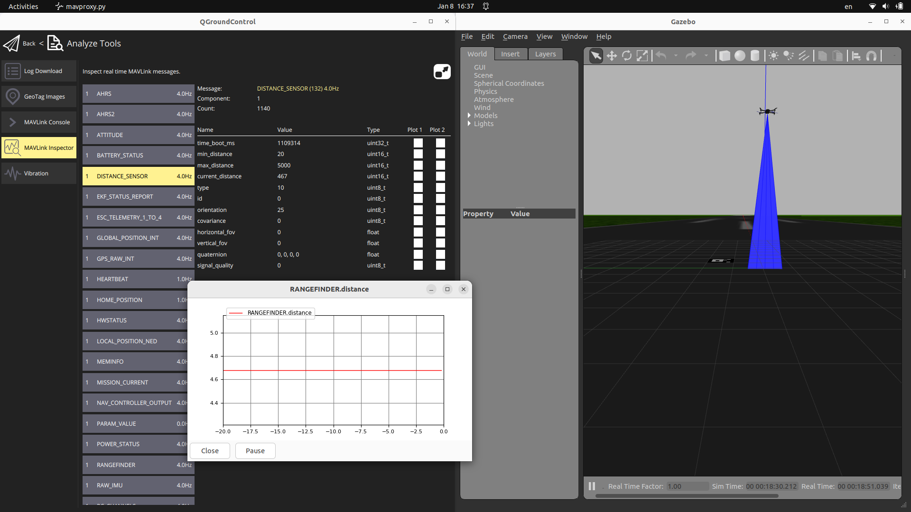

# RangeFinder 
- Sim Ultrasonic sensor from gazebo
- Config SITL params `RNGFND1_TYPE 10` `RNGFND1_ORIENT 25`
- Send `DISTANCE_SENSOR` mavlink message
- Try to read RANGEFINDER `message #173` from `http://mavlink.io/en/messages/ardupilotmega.html`



## How to run
### gazebo
```bash title="gazebo"
# launch iris_arducopter_runway world with `iris_rangefinder` model
# model from px4 repository
ros2 launch wasp_bringup wasp.launch.py
```

### sitl

```bash title="sitl"
# ros2 launch wasp_bringup sitl.launch.py
# or cli (for know cli is the one)
sim_vehicle.py -v ArduCopter -f gazebo-iris -A "--defaults /home/user/wasp_ws/src/wasp_bringup/config/copter.parm,/home/user/wasp_ws/src/wasp_bringup/config/gazebo-iris.parm" -I0
```

### mavproxy commands

```bash
output add 127.0.0.1:14552
# run test_range node
module load graph
graph RANGEFINDER.distance

mode guided
arm throttle
takeoff 5
```
### simple node for test
- using drone-kit

```
ros2 run wasp test_range
```
---

### notes
```bash title="silt"
arducopter -S --model gazebo-iris --speedup 1 --slave 0 --defaults /home/user/git/ardupilot/Tools/autotest/default_params/copter.parm,/home/user/git/ardupilot/Tools/autotest/default_params/gazebo-iris.parm -I0
```

```bash title="mavproxy"
"mavproxy.py" "--out" "127.0.0.1:14550" "--out" "127.0.0.1:14551" "--master" "tcp:127.0.0.1:5760" "--sitl" "127.0.0.1:5501"
```
